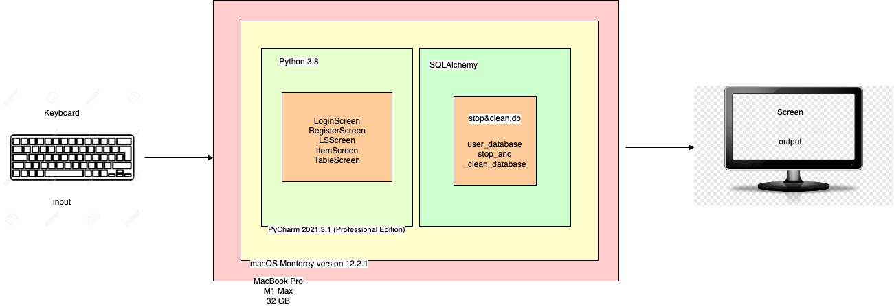
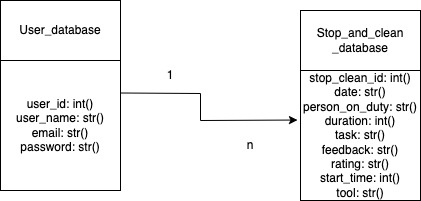
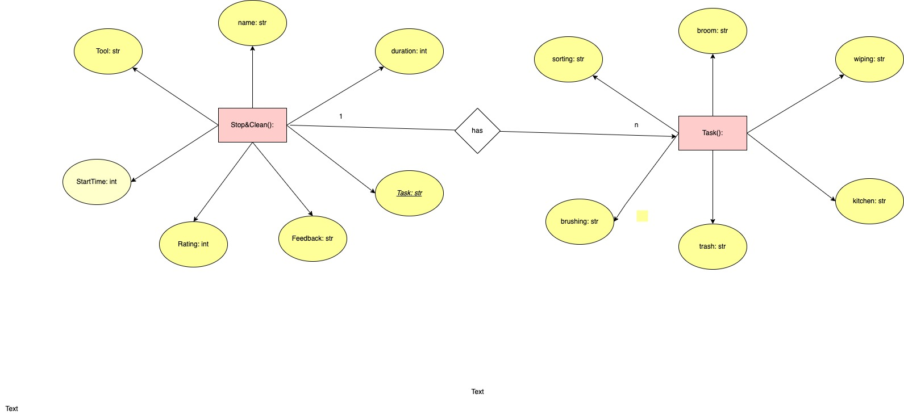

# Project 3

## Criterion A: Planning

### Problem definition

Michael Jian Cheng Tseng, the client, needs a tool to manage the everyday stop and clean schedule, its content, and feedback. It has to cover the date, tools used, duration, tasks, name of the person in charge of the task, and feedback to the stop and clean by a teacher.

### Proposed Solution

#### Design Statement

I will to design and make an application for a client who wants a tool to keep the records of the stop and clean his house had. The application records the notes for everyday stop and clean, and provides sign-up/log-in system to the users. It will take 4 weeks to make and will be evaluated according to the criteria shown below. 

#### System

The stopandclean managing tool is going to be developed on a programming editor: Pycharm on macOS Monterey version 12.2.1 on MacBook Pro. On Pycharm, the application will use SQLite to store the database on users, SQLalchemy to create an ORM system, and KivyMD to develop the main system.

#### Justification of the software selected

##### Python

The reason I chose Python for the main programming language to develop this application is that Python is one of the most commonly used programming language and therefore there are plenty of resources and sample codes on the Internet. Also, Python is considered to be the most accessible and simplest language for beginner programmers. Another reason why I use Python is simply that I am familiar with this language and it should be more accurate and faster to use this language than other languages like C. The last reason is that Python can be used as an OOP language. Adopting OOP for the project make it more effortless to keep track on the complex codings and unique properties of OOP like inheritance enables me to simplify the code.

##### KivyMD

I am going to use KivyMD to create GUI for the application because it is a relatively user-friendly open source library for beginners as well as the fact that this is the most popular GUI library on Python. 

##### SQLAlchemy

In order to manage the database for this application, I am using SQLAlchemy. SQLAlchemy enhances the flexibility and accessibility of SQL as one of the most common languge to manipulate database. Also, this SQLAlchemy correponds to the ORM use, so there is no need to learn the SQL language from zero.

### Success Criteria

1. The application is going to keep the records of stop and clean including the date, tools used, duration, tasks, name of the person in charge of the task, and feedback on the stop and clean by a teacher.
2. The application has a log-in system and sign-up system for the users.
3. The application is going to store the records on its database.
4. The application uses GUI.
5. The application has to be controled with the keyboard and cursor action.
6. The application uses English as the main language.

## Criterion B

### System Diagram

### UML Diagram

### ER Diagram

### Table of planning

| No. | task                                     | content                                    | duration | date        | success criteria |
|-----|------------------------------------------|--------------------------------------------|----------|-------------|------------------|
| 1   | discuss about the outline of the product | identify the problem and ideate a solution | 20 min   | March 2nd   | A                |
| 2   | proposed solution and criteria A         | complete criteria A                        | 1 h      | March 18th  | A                |
| 3   | draw diagrams                            | draw UML, ER, system diagram               | 40 min   | March 18th  | B                |
| 4   | Login screen                             | develop login screen                       | 1.5 h    | April 10th  | C                |
| 5   | signup screen                            | develop signup screen                      | 1.5 h    | April 18th  | C                |
| 6   | main screen                              | develop main screen                        | 1.5 h    | April 18th  | C                |
| 7   | table screen                             | develop table screen                       | 1.5 h    | April 20th  | C                |
| 8   | testing                                  | test the functionality                     | 1.5 h    |  April 21st | D                |
| 9   | MVP video                                | film the MVP video                         | 30 min   | April 21st  | D                |

### 
