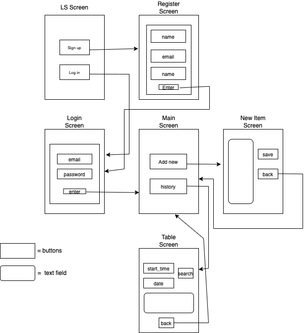
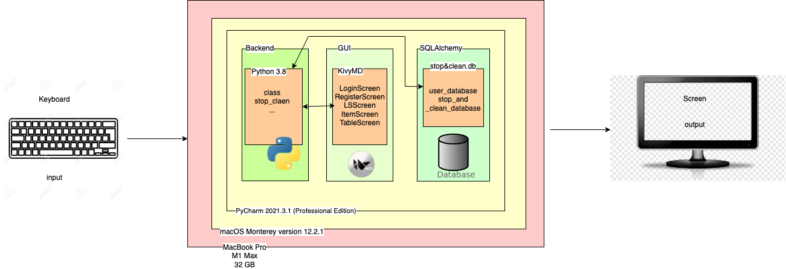
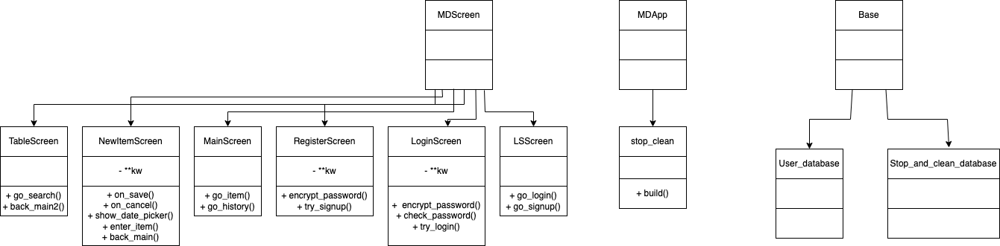
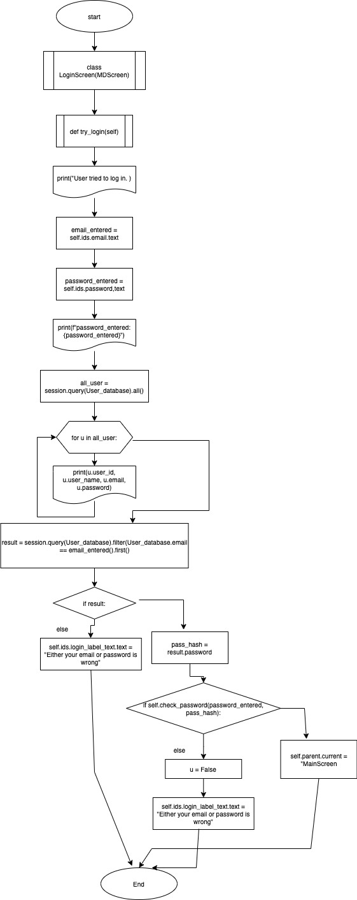
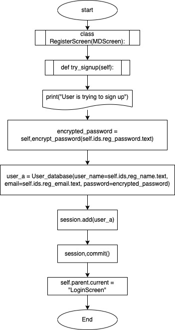
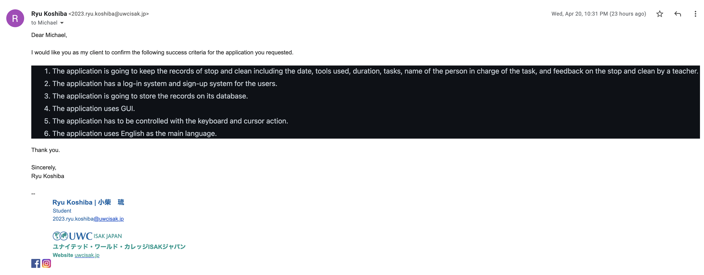
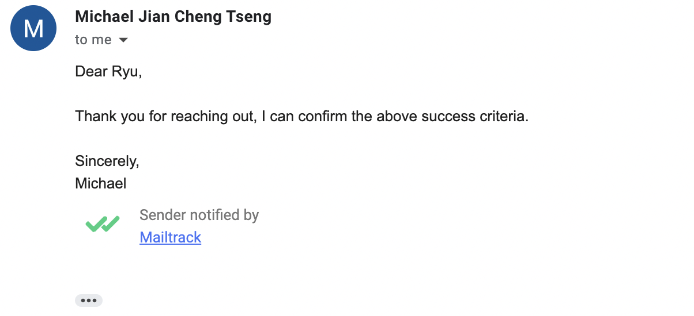

# Project 3

## Criteria A: Planning

### Problem definition

My client needs a tool to manage the everyday stop and clean schedule, its content, and feedback. It has to cover the date, tools used, duration, tasks, name of the person in charge of the task, and feedback to the stop and clean by a teacher. To make it available, we came to an agreement that a stop&clean record management application on computer is useful. 

### Proposed Solution

#### Design Statement

I will design and make a computer application for a client who wants a tool to keep the records of the stop and clean, which is a way to call house or residence cleaning in UWC ISAK Japan. The application records the notes for everyday stop and clean, and provides sign-up/log-in system to the users. It will take 4 weeks to make and will be evaluated according to the criteria shown below. 

#### System

The stopandclean managing tool is going to be developed on a programming editor: Pycharm on macOS Monterey version 12.2.1 on MacBook Pro. On Pycharm, the application will use SQLite to store the database on users, SQLalchemy to create an ORM system, and KivyMD to develop the main system.

#### Justification of the software selected

##### Python

The reason I chose Python for the main programming language to develop this application is that Python is one of the most commonly used programming language according to TOBE and PYPL. Therefore, there are plenty of resources and sample codes on the Internet. Also, Many websites about programming including smartbear.com, springboard.com, and bestcolleges.com say Python is in the list of the most accessible and simplest languages for beginner programmers. Another reason why I use Python is simply that I am familiar with this language and it should be more accurate and faster to use this language than other languages like C. The last reason is that Python can be used as an OOP language. Adopting OOP for the project make it more effortless to keep track on the complex codings and unique properties of OOP like inheritance enables me to simplify the code. Since the application my client requested is going to be simple-structured and does not particularly require speed, there is no need to use more complicated languages.

##### KivyMD

I am going to use KivyMD to create GUI for the application. KivyMD is a Is a collection of Material Design compliant widgets for use with Kivy, which is an open source software library for the development of applications equipped with user interfaces, such as multi-touch apps. Kivy is one of the most popular GUI libraries on Python with abundance of resources and tips on the Internet according to activestate.com. When you develop an application on KivyMD, it separates python file; the backend part that runs the system, and kivy file; the frontend part that designs the UI, thereby it is easier to find and solve errors or any issue on the program as I can treat the frontend and the backend separately. Since it is the first time for me to develop an application and I need to use other python frameworks, these features are benefitial for the development. KivyMD is specialized at a simple structure with compilations of widgets that is suitable for the development of this application in terms of simplicity and affinity to other python frameworks.

##### SQLAlchemy

In order to manage the database for this application, I am using SQLAlchemy. SQLAlchemy is the Python SQL toolkit and Object Relational Mapper that gives application developers the full power and flexibility of SQL. SQL is a popular database language to manipulate database with various programming languages. Its system is pretty simple and both the syntax and the commands are close to English. Also, this SQLAlchemy correponds to the ORM use, so there is no need to learn the SQL language from zero. With the use of SQL, it takes less time and codes to project the data table on the UI. The affinity to KivyMD and Python is attractive for me as a developper. 

### Success Criteria

1. The application is going to keep the records of stop and clean including the date, tools used, duration, tasks, name of the person in charge of the task, and feedback on the stop and clean by a teacher.
2. The application has a log-in system and sign-up system for the users.
3. The application is going to store the records on its database.
4. The application uses GUI.
5. The application has to be controled with the keyboard and cursor action.
6. The application uses English as the main language.

### Success Criteria revised

1. The application is going to keep the persistent records of stop and clean including the date, tools used, duration, tasks, name of the person in charge of the task, and feedback on the stop and clean by a teacher.
2. The application has a log-in system and sign-up system for the users.
3. All the data about users and stop&clean records are encrypted and stored.
4. The application uses graphical user interface.
5. The users of this application are available to check the past records by entering some hints.
6. The users are able to add stop&clean records freely.


## Criteria B

### Wire Frame



### System Diagram



### UML Diagram



### ER Diagram


### Flow Diagram

#### Login Screen



#### Signup Screen



### Testing

| No. | step                    | type of test        | procedure                                                                                          | success criteria                                               | success? |
|-----|-------------------------|---------------------|----------------------------------------------------------------------------------------------------|----------------------------------------------------------------|----------|
| 1   | Sign up and log in      | integration testing | Sign up and log in with the email and password just used in signup                                 | To log in and move to the main screen                          | Yes      |
| 2   | encryption test         | unit testing        | print the encrypted password and confirm if it is encrypted                                        | encrypted password is printed                                  | Yes      |
| 3   | add new items           | unit testing        | add new items on the NewItemScreen and confirm if it is saved on the database                      | new items on the database                                      | Yes      |
| 4   | search the record error | unit testing        | enter keywords that does not exist on the database and see if an error shows up                    | all the labels in the search result turns to "None"            | Yes      |
| 5   | search the record       | unit testing        | enter keywords and confirm the record that relates to the keyword shows up.                        | The records are show in the search result                      | Yes      |
| 6   | Final software check    | system testing      | Verify the software works properly without bugs or typos throughout the program                    | the software functions without bugs or any kind of malfunction | Yes      |
| 7   | Good coding practice    | usability testing   | confirm if the code is entirely commented and easy for the future developers to figure the funcion | the code is entirely commented                                 | Yes      |

### Table of planning

| No. | task                                     | content                                    | duration | date        | success criteria |
|-----|------------------------------------------|--------------------------------------------|----------|-------------|------------------|
| 1   | discuss about the outline of the product | identify the problem and ideate a solution | 20 min   | March 2nd   | A                |
| 2   | proposed solution and criteria A         | complete criteria A                        | 1 h      | March 18th  | A                |
| 3   | draw diagrams                            | draw UML, ER, system diagram               | 40 min   | March 18th  | B                |
| 4   | Login screen                             | develop login screen                       | 1.5 h    | April 10th  | C                |
| 5   | signup screen                            | develop signup screen                      | 1.5 h    | April 18th  | C                |
| 6   | main screen                              | develop main screen                        | 1.5 h    | April 18th  | C                |
| 7   | table screen                             | develop table screen                       | 1.5 h    | April 20th  | C                |
| 9   | MVP video                                | film the MVP video                         | 30 min   | April 21st  | D                |

## Criteria C

### Existing tools

#### OOP paradigm

Object Oriented programming (OOP) is a programming paradigm that relies on the concept of classes and objects.

```.py
class LoginScreen(MDScreen):
    ''' This class creates the log in window for the application'''

    def __init__(self, **kw):
        super().__init__(**kw)
        # determines the method of encrypting password
        self.pwd_context = CryptContext(
            schemes=["pbkdf2_sha256"],
            default="pbkdf2_sha256",
            pbkdf2_sha256__default_rounds=30000
        )

    def encrypt_password(self, password):
        return self.pwd_context.hash(password)

    def check_password(self, password, hashed):
        return self.pwd_context.verify(password, hashed)

    def try_login(self):
        print("User tried to log in.")
        email_entered = self.ids.email.text
        password_entered = self.ids.password.text
        print(f"password_entered: {password_entered}")
        all_user = session.query(User_database).all() # all columns in the table
        for u in all_user:
            print(u.user_id, u.user_name, u.email, u.password)
        # values in the table when email is what is entered
        result = session.query(User_database).filter(User_database.email == email_entered).first()
        print(result)
        if result:
            pass_hash = result.password
            if self.check_password(password_entered, pass_hash):
                self.parent.current = "MainScreen"
            else:
                u = False
                self.ids.login_label_text.text = "Either your email or password is wrong"
        else:
            u = False
            self.ids.login_label_text.text = "Either your email or password is wrong"
```

Above is the class for the login screen of the app. The first function; initializer defines the attributes used in the class. In this case, it defines the method of encrypting the passwords. The function "try_login" let the user move on to the next screen when the email and the password entered are already existing in the user database. OOP paradigm is the most adequate method of coding this app because it is effortless and quick to find the function that I am looking for and also easy to find the issues in the code. 

```.py
class RegisterScreen(MDScreen):
    def __init__(self, **kw):
        super().__init__(**kw)
        # method of encryption
        self.pwd_context = CryptContext(
            schemes=["pbkdf2_sha256"],
            default="pbkdf2_sha256",
            pbkdf2_sha256__default_rounds=30000
        )

    def encrypt_password(self, password):
        return self.pwd_context.hash(password)

    def try_signup(self):
        print("User is trying to sign up")
        encrypted_password = self.encrypt_password(self.ids.reg_password.text)
        user_a = User_database(user_name=self.ids.reg_name.text, email=self.ids.reg_email.text,
                               password=encrypted_password)
        session.add(user_a) # adds a new data to the table
        session.commit()
        self.parent.current = "LoginScreen"

```

This is the code for the signup screen of this app. Like all other parts of this code, this is also using OOP paradigm.

#### KivyMD Library

To install the KivyMD library, I used the command pip install KivyMD on the terminal.

```.py
# functions to build an app
from kivymd.app import MDApp
# functions to build and manage a screen
from kivymd.uix.screen import MDScreen
# functions to create a calendar on kivymd
from kivymd.uix.pickers import MDDatePicker
```

Above are the example of a code that imports necessary funcitons from the open-source library of kivyMD.

```.py
ScreenManager:
    id: scr_manager
    size: 500, 300

    LSScreen:
        name: "LSScreen"

    LoginScreen:
        name: "LoginScreen"

    MainScreen:
        name: "MainScreen"

    TableScreen:
        name: "TableScreen"

    RegisterScreen:
        name: "RegisterScreen"

    NewItemScreen:
        name: "NewItemScreen"
```

Above is the screen manager using KivyMD. The advantage of using KivyMD for applicaiton development is that its library contains abundance of useful functions and elements and all users can access it for free. Also, the structure is simple and easy for the beginners.

```.py
<LoginScreen>:
    FitImage:
        source: 'st_cl.jpeg'

    MDCard:
        size_hint: .5, .8
        pos_hint: {"center_x":.5, "center_y":.45}
        md_bg_color: .2, .5, .6, .6

    MDBoxLayout:
        size_hint: 0.4, 0.8
        orientation: "vertical"
        pos_hint: {"center_x":.5}

        MDLabel:
            id: login_label_text
            text: "Log in"
            font_size: "20px"
            halign: 'center'
            size_hint: 1, .3

        MDTextField:
            id: email
            hint_text: "email"
            color_mode: 'custom'
            line_color_focus: 1, 1, 0, 1
            icon_right: "email"
            mode: "rectangle"
            size_hint: 1, .1

        MDLabel:
            size_hint: 1, .03

        MDTextField:
            id: password
            password: True
            hint_text: "password"
            color_mode: 'custom'
            line_color_focus: 1, 1, 0, 1
            icon_right: "eye-off"
            mode: "rectangle"
            size_hint: 1, .1

        MDLabel:
            size_hint: 1, .1

        MDRaisedButton:
            text: "enter"
            on_release:
                root.try_login()
            size_hint: .2, .07
            md_bg_color: 0.25, 0, 5, .3

        MDLabel:
            size_hint: 1, .1
```

This is the UI backend of the app for the login screen. I designed the layout using MDBoxLayout, which enables users to place widgets in a row. I also utilized MDTextField and MDRaisedButton to obtain the inputs from the user. 

#### passlib encryption

```.py
from passlib.context import CryptContext
```

Above is to install the passlib encryption function.

```.py
class RegisterScreen(MDScreen):
    def __init__(self, **kw):
        super().__init__(**kw)
        # method of encryption
        self.pwd_context = CryptContext(
            schemes=["pbkdf2_sha256"],
            default="pbkdf2_sha256",
            pbkdf2_sha256__default_rounds=30000
        )

    def encrypt_password(self, password):
        return self.pwd_context.hash(password)

    def try_signup(self):
        print("User is trying to sign up")
        encrypted_password = self.encrypt_password(self.ids.reg_password.text)
        user_a = User_database(user_name=self.ids.reg_name.text, email=self.ids.reg_email.text,
                               password=encrypted_password)
        session.add(user_a) # adds a new data to the table
        session.commit()
        self.parent.current = "LoginScreen"
```

Again, the example of the use of passlib encryption is the class for the signup screen. 

```.py
self.pwd_context = CryptContext(
            schemes=["pbkdf2_sha256"],
            default="pbkdf2_sha256",
            pbkdf2_sha256__default_rounds=30000
        )
```

This part determines the design of how to encrypt the code.

```.py
    def encrypt_password(self, password):
        return self.pwd_context.hash(password)
```

This function returns the encrypted value using passlib encryption.

```.py
    def try_signup(self):
        print("User is trying to sign up")
        encrypted_password = self.encrypt_password(self.ids.reg_password.text)
        user_a = User_database(user_name=self.ids.reg_name.text, email=self.ids.reg_email.text,
                               password=encrypted_password)
        session.add(user_a) # adds a new data to the table
        session.commit()
        self.parent.current = "LoginScreen"
```

This fuction is using the function created above; encrypt_password to encrypt the password.

#### SQLAlchemy ORM

To install SQLAlchemy, I used the command pip install SQLAlchemy on the terminal. The advantage of using ORM is that I can use normal Python grammar to generate and manage database.

```.py
# functions to create session
from sqlalchemy import create_engine
from sqlalchemy.orm import sessionmaker
```

This is importing functions to create session for the database.

```.py
from sqlalchemy.ext.declarative import declarative_base
from sqlalchemy.schema import Column
from sqlalchemy.types import Integer, String
```

This is importing functions to create tables.

```.py
db_engine = create_engine("sqlite:///stop&clean.db") # creates engine(actual database)
Base = declarative_base()
```

Above is creating the base of database

```.py
class User_database(Base):
    # creates a table and its columns for user database
    __tablename__ = "user_info"  # name the table
    user_id = Column(Integer, primary_key=True)
    user_name = Column(String(255))
    email = Column(String(255))
    password = Column(Integer)
```

This is an example of a class that is created to make new tables.

```.py
all_user = session.query(User_database).all() # all columns in the table
        for u in all_user:
            print(u.user_id, u.user_name, u.email, u.password)
        # values in the table when email is what is entered
        result = session.query(User_database).filter(User_database.email == email_entered).first()
```

Above is an extract from the try_login class. It is creating a query that selects all the data which suit the condition.

### Software Update

Software update will be done when there is a request from the client or I find a crucial bug or any kind of issue in the code. The update will adopt a phased changeover considering the scale of the service and there is going to be only minor changes or updates in the code. A phased changeover is a method that converts one module of the system at a time.

## Criteria D

### Demonstration video

https://drive.google.com/file/d/1_TIlGAVxw2Q7OC7bdHgAil83Jq2sUxaT/view?usp=sharing


## Appendix

#### Client confirmation





### Works cited

@ariku. “SQLAlchemyの基本的な使い方.” Qiita, 14 Aug. 2021, qiita.com/ariku/items/75799665acd09520bed2.   
  
Albert, Adwin, et al. “Valueerror: Mdlabel._text Accept Only STR.” Stack Overflow, 1 Aug. 2020, stackoverflow.com/questions/64783110/valueerror-mdlabel-text-accept-only-str.   
  
Assurance Technologies. “CryptContext Tutorial¶.” CryptContext Tutorial - Passlib v1.7.4 Documentation, 8 Oct. 2020, passlib.readthedocs.io/en/stable/narr/context-tutorial.html.   
  
Dimitriou, Kostas, and Markos Hatzitaskos. Core Computer Science: For the IB Diploma Program (International Baccalaureate). Express Publishing, 2018.   
  
Doherty, Erin. “What Is Object-Oriented Programming? Oop Explained in Depth.” Educative, 15 Apr. 2020, www.educative.io/blog/object-oriented-programming.   
  
Rodríguez, Andrés, et al. “Welcome to KIVYMD's Documentation!¶.” Welcome to KivyMD's Documentation! - KivyMD Documentation, 2020, kivymd.readthedocs.io/en/0.104.1/index.html.   
  
the SQLAlchemy authors and contributors. “SQLAlchemy 1.4 Documentation.” ORM Quick Start - SQLAlchemy 1.4 Documentation, 6 Apr. 2022, docs.sqlalchemy.org/en/14/orm/quickstart.html. 

https://pypl.github.io/PYPL.html
https://www.tiobe.com/tiobe-index/
https://smartbear.com/blog/best-programming-language-to-learn-first/#:~:text=Python,someone%20who's%20new%20to%20programming.
https://www.springboard.com/blog/software-engineering/top-programming-languages/
https://www.bestcolleges.com/bootcamps/guides/6-easiest-programming-languages-to-learn/
https://www.activestate.com/blog/the-best-python-frameworks-for-mobile-development-and-how-to-use-them/
https://kivymd.readthedocs.io/en/latest/
https://kivy.org/doc/stable/gettingstarted/intro.html
https://pypi.org/project/SQLAlchemy/
https://quintagroup.com/cms/python/sqlalchemy
